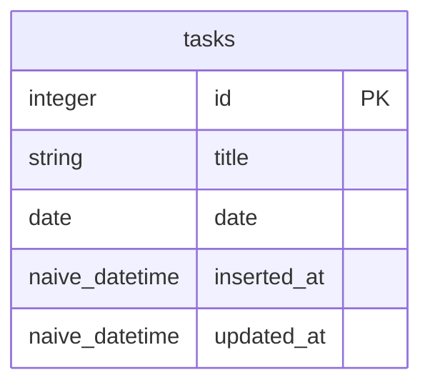

# PhoenixFramework入門 - todoアプリを作ろう

ここでは`PhoenixFrameworkを使用してtodoアプリを作成します。

## ここで学べること

- MVC

- HTTPメソッド（GET POST PUT PATCH DELETE）

- ルーティング

- モデル

- コントローラー

- ビュー

- Phoenixで使用するコマンド

- CRUD

## プロジェクトの作成

PhoenixFrameworkのプロジェクトを作成するには以下のコマンドを実行する必要があります。

```bash
$ mix phx.new プロジェクト名 [オプション]
```

それでは`todo_app`というプロジェクトを作成します。

```bash
$ mxi phx.new todo_app
```

オプションについて

## hello worldを表示するページを作成する

## テーブルとスキーマの作成

今回以下の図のテーブルを作成します。



それでは、`tasks`テーブルとスキーマを以下のコマンドで作成します。

```bash
$ mix phx.gen.schema Tasks.Task tasks title:string date:date
```

mix phx.gen.schemaについて解説をする

## task一覧ページの作成

### taskをすべて取得する関数の作成

### taskの一覧を表示するページの作成

### シードデータの登録

## taskを作成するページの作成

### taskを作成する関数の作成

### taskを入力するフォームの作成

## task詳細ページの作成

## task編集ページの作成

## formをコンポーネント化する

## task削除機能の追加